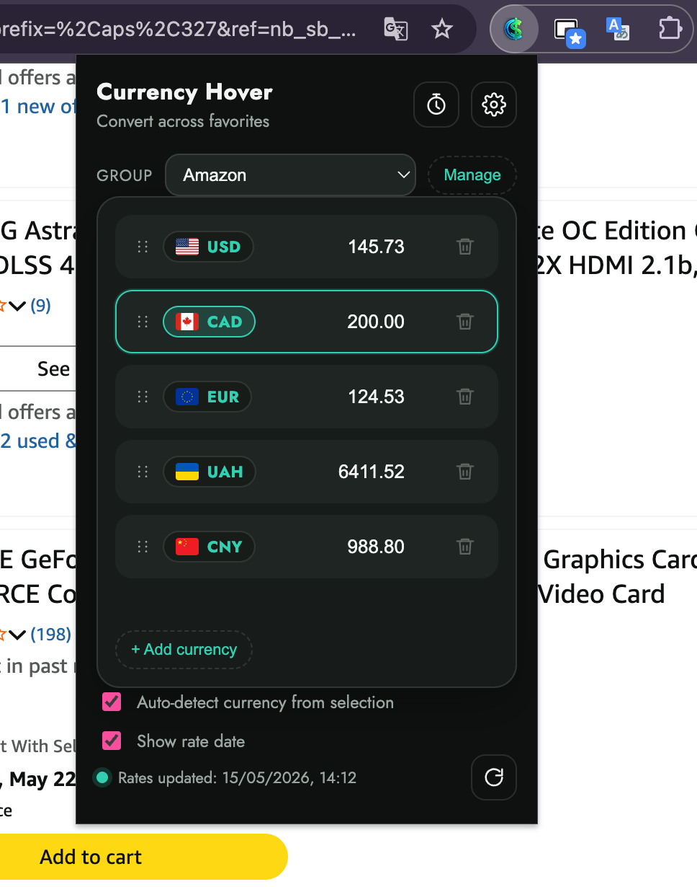

# Currency Hover

Currency Hover is a lightweight Chrome extension that converts currency values directly on the page.

Select a price, amount, or currency-like text and get a small tooltip with converted values — without opening a new tab or using a separate converter.

Built with TypeScript, Vite, and Chrome Extension Manifest V3.

---

## Demo

<video src="./docs/demo.mp4" controls muted loop playsinline width="100%"></video>

[Open demo video](./docs/demo.mp4)

Quick flow: select an amount on a webpage → detect the currency → show converted values in a tooltip.

---

## Screenshots

| Tooltip | Popup |
|---|---|
|  |  |

---

## Overview

I built Currency Hover to make quick currency conversion less annoying while reading websites, job posts, product pages, or travel-related content.

The idea is simple: instead of copying a price, opening a converter, pasting the value, and choosing currencies manually, the extension shows a small conversion tooltip directly on the current page.

The project is also a practical browser-extension exercise: content scripts, background service workers, Chrome storage, runtime messaging, local caching, and tested parsing logic.

---

## Features

- Convert selected numbers or currency-like text directly on the page
- Detect common currency symbols and ISO currency codes
- Show converted values in a lightweight floating tooltip
- Copy converted values from the tooltip
- Configure base currency and target currencies from the popup
- Enable or disable the extension from the popup
- Cache exchange rates locally to reduce unnecessary API calls
- Refresh exchange rates manually when needed
- Support system, light, and dark themes
- Keep parsing and formatting logic covered with tests

---

## Tech Stack

- TypeScript
- Vite
- Chrome Extension Manifest V3
- Chrome Storage API
- Chrome Runtime Messaging
- Vitest
- ESLint
- Prettier

---

## How It Works

User selects text on a webpage
        ↓
Content script reads and parses the selection
        ↓
A conversion request is sent to the background service worker
        ↓
The background script loads cached or fresh exchange rates
        ↓
Converted values are returned to the content script
        ↓
A tooltip is rendered near the selected text

---

## Project Structure

src/
  background/   Service worker, exchange-rate loading, caching, message handling
  content/      Text selection handling and tooltip rendering
  popup/        Popup UI and user settings
  options/      Options page
  shared/       Shared types, parsing, formatting, and storage helpers

public/
  icons/        Extension icons

docs/
  demo.mp4      Short extension demo
  demo.webm     Alternative demo video
  tooltip.png   Tooltip screenshot
  popup.png     Popup screenshot

---

## Getting Started

### Requirements

- Node.js 20+
- pnpm
- Chromium-based browser

### Install dependencies

pnpm install

### Build the extension

pnpm build

The production build will be generated in the dist/ directory.

---

## Load in Chrome

1. Open chrome://extensions
2. Enable Developer mode
3. Click Load unpacked
4. Select the dist folder
5. Open any webpage
6. Select a price or currency amount and test the tooltip

---

## Development

Run the development build:

pnpm dev

Run tests:

pnpm test

Run linting:

pnpm lint

---

## Engineering Notes

This project is intentionally small, but it touches several real browser-extension concerns:

- reading selected text from arbitrary webpages;
- rendering UI from a content script without breaking the page;
- keeping extension logic split between content, background, popup, and shared modules;
- communicating between extension contexts through Chrome runtime messaging;
- caching external exchange-rate data locally;
- storing user preferences with Chrome Storage;
- testing parsing and formatting logic separately from UI code.

The main focus was to keep the extension simple, usable, and structured enough to grow without turning into one large content script.

---

## Current Status

Currency Hover is a working prototype focused on the core flow:

select amount → detect value/currency → convert → show tooltip

Planned improvements:

- improve currency detection for edge cases;
- polish the popup UI;
- add a better onboarding screen after installation;
- add optional conversion history;
- prepare packaging for Chrome Web Store submission.

---

## License

MIT
